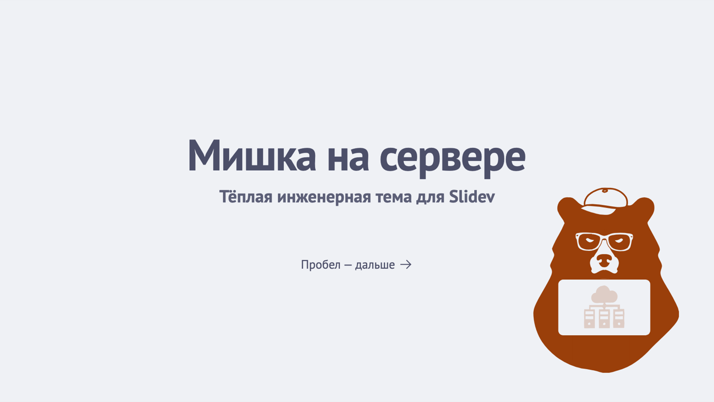
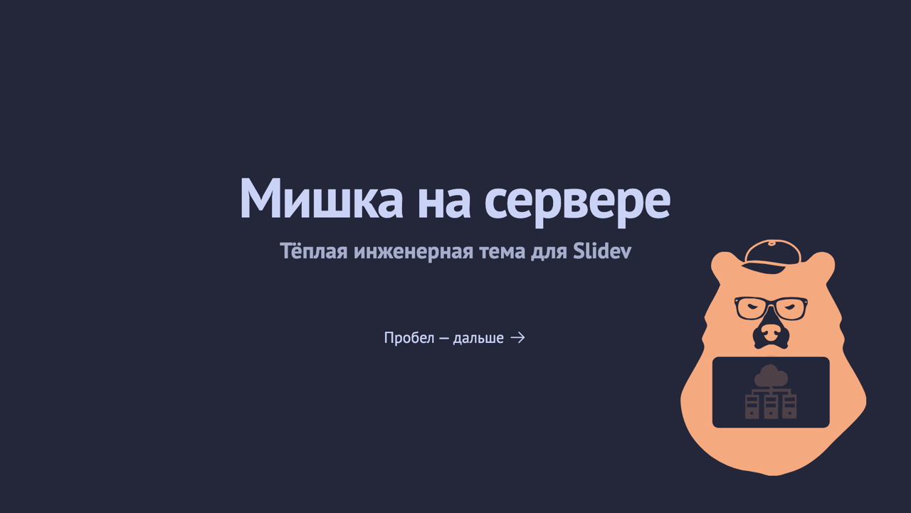
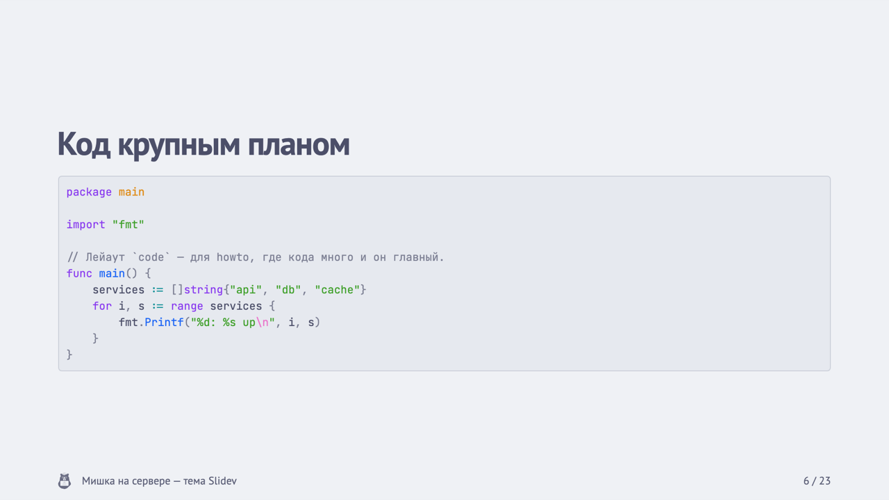
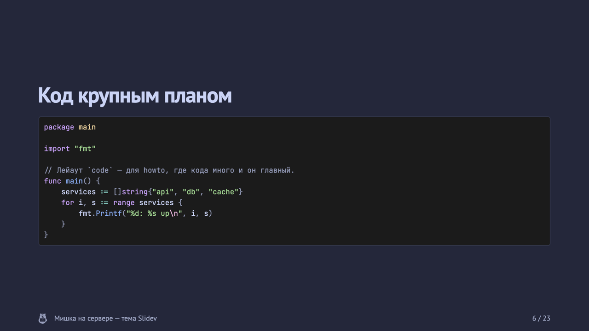
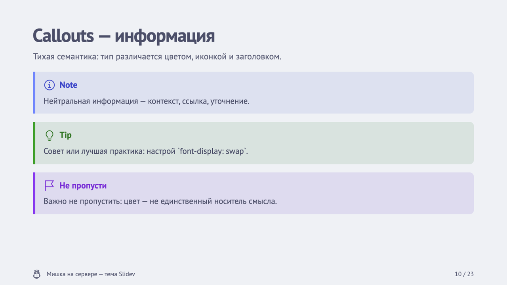
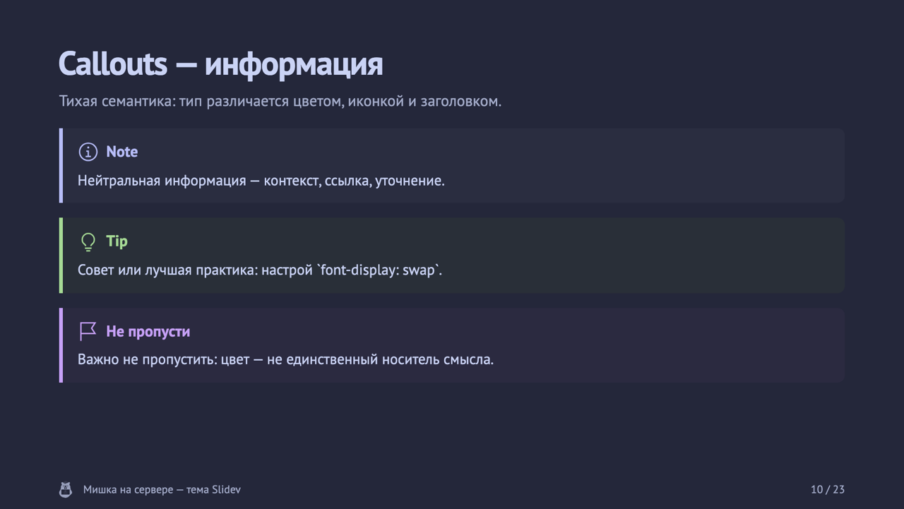

# slidev-theme-bear

[](https://github.com/jtprogru/slidev-theme-bear/actions/workflows/ci.yml)
[](https://sli.dev)
[](LICENSE)

Тема **«Мишка на сервере»** для [Slidev](https://github.com/slidevjs/slidev): технический скелет + тёплая подача. Холодная приглушённая палитра catppuccin (Latte/Macchiato), один акцент Sapphire, catppuccin-подсветка кода, PT Sans + JetBrains Mono (self-hosted, кириллица), доступность ≥ AA. Теплота бренда живёт в маскоте и голосе, а не в цвете. Перенос [дизайн-кода блога jtprog.ru](https://jtprog.ru) в формат слайдов.

| Светлая тема | Тёмная тема |
| --- | --- |
|  |  |
|  |  |
|  |  |

Обе темы — не два разных дека, а одни и те же токены с двумя значениями. Слайды выше сняты с одного `example.md` и пересобираются командой `make preview`.

## Требования

- Node `^22.18 || ^24.11 || >=26`
- Slidev `>= 52`

## Установка

Тема не публикуется в npm — ставится из GitHub:

```bash
npm i -D github:jtprogru/slidev-theme-bear
```

Дальше во frontmatter `slides.md`:

```yaml
---
theme: bear
---
```

Slidev разворачивает `bear` в имя пакета `slidev-theme-bear` и находит его в `node_modules` — предложения «установить тему», как для npm-тем, не будет, потому что зависимость уже стоит. Подробнее — [как использовать тему](https://sli.dev/themes/use).

Если правишь саму тему, а не пользуешься ей, дек в репозитории уже настроен: в `example.md` стоит `theme: ./`.

## Лейауты

Тема расширяет встроенный набор Slidev (`default`, `center`, `two-cols`, `two-cols-header`, `full` перекрашены под бренд) семнадцатью своими:

| Лейаут | Назначение | Особые опции |
| --- | --- | --- |
| `cover` | Обложка (тёплая зона) | `mascot: true` — показать маскота |
| `intro` / `intro-image` / `intro-image-right` | Вводные слайды | `image:` |
| `section` | Разделитель | `mascot: true` |
| `bullets` | Список тезисов | — |
| `code` | Код крупным планом (howto) | — |
| `image-right` / `image-left` | Текст + картинка сбоку | `image:` |
| `image` | Картинка во весь экран | `image:`, `dim: true` |
| `3-images` | Три изображения | `imageLeft:`, `imageTopRight:`, `imageBottomRight:` |
| `fact` / `big-metric` | Крупная цифра/факт | — |
| `statement` | Одна мысль на весь экран | — |
| `quote` | Цитата | — |
| `outro` | Итоги, ссылки, контакты | `logo: true` — показать логотип |
| `questions` | «Вопросы?» (тёплая зона) | `mascot: true` (по умолчанию) |

## Компоненты

Автоимпортируются, доступны в любом слайде без импорта:

- **`<Callout type="…" title="…">`** — семантические callouts: `note`, `tip`, `important`, `warn`, `danger`. Каждый тип различается цветом, иконкой и заголовком (цвет — не единственный носитель смысла).
- **`<BearMark :size="24" />`** — знак (mark): упрощённый медведь для футера/шапки/мелких размеров. Одноцветный, наследует цвет текста.
- **`<BearLogo :size="40" />`** — логотип: знак + словесный знак, для титула и контактов. Тоже наследует цвет текста.
- **`<Mascot :size="200" />`** — маскот: живой медведь для тёплых зон (обложка, разделы, QA). Вставляется инлайном и перекрашивается вместе с темой; своя иллюстрация — `src="/path.svg"`.
Футер (`global-top.vue`) со знаком, названием доклада и номером слайда показывается на контентных слайдах и скрывается на титульных/тёплых.

## Цвет

Один холодный акцент Sapphire на приглушённой базе catppuccin (Latte на свету, Macchiato в темноте). Токены объявлены в `styles/vars.css` (свет/тьма), проброшены в UnoCSS через `uno.config.ts` (`bg-elev`, `text-ink`, `text-muted`, `border-hair`, `text-accent-700`, `text-link` …).

| Токен | Роль |
| --- | --- |
| `--accent-300/400/600/700` | Акцентная шкала Sapphire: `400` — декор, `700`/`300` — текст ссылок (AA) |
| `--bg` / `--bg-elev` | Фон страницы (crust) / карточки и код (base) |
| `--fg` / `--fg-muted` | Текст / мета |
| `--border` | Разделители |
| `--c-note/tip/important/warn/danger` | Семантика callouts (Lavender/Green/Mauve/Peach/Red) |
| `--mascot-ink` / `--mascot-paper` | Тона маскота: по умолчанию `--c-warn-text` и `--bg` |

Переопределить акцент можно через `themeConfig` в headmatter: `themeConfig: { primary: '#209fb5' }`. Монохромный маскот под цвет знака — `:root { --mascot-ink: var(--fg-muted); }` в стилях колоды.

Контраст проверяется скриптом `npm run contrast` и падает в CI, если пара опустилась ниже WCAG AA: 4.5:1 для текста, 3:1 для графики (маскот).

## Шрифты

Self-hosted (офлайн-показ, OFL, кириллица): **PT Sans** (тело) + **JetBrains Mono** (код) через `@fontsource/*`, `provider: none` — Slidev не ходит в Google Fonts.

## Код

Подсветка — **catppuccin** (`catppuccin-latte` / `catppuccin-macchiato`) через `setup/shiki.ts`. Построена ровно на тех же тонах, что и UI: блок кода и интерфейс — одна система, а не два соседа.

## Айдентика

Знак, логотип, маскот и фавиконы не лежат в теме своей копией — они приезжают из дизайн-системы [`@jtprogru/mishka-ds`](https://github.com/jtprogru/mishka-ds), где собираются из одного артворка `brand/mishka-mark-source.svg`. Копия расходится с источником, ссылка — нет: янтарный медведь из палитры 0.1 уже пережил переезд темы на холодную, потому что жил здесь отдельным файлом.

Синхронизацию делает `scripts/sync-brand.mjs`. Он висит на `prepare`, то есть отрабатывает сам на каждом `npm install` / `npm ci`:

- `public/brand/{mark,logo,mascot,favicon-light,favicon-dark}.svg` — файловые копии;
- `components/brandAssets.ts` — знак, логотип и маскот строками, для инлайна в DOM.

Инлайн нужен по двум причинам. Первая — цвет. Знак и логотип залиты `currentColor` и наследуют цвет текста, но внутри `` `currentColor` резолвится в чёрный, и на тёмной теме медведь бы пропал. Маскот в файле крашен литералами светлой темы, поэтому скрипт заменяет их на `--mascot-ink` и `--mascot-paper`, и на Macchiato бумага становится тёмной, а чернила — макиатовым Peach.

Вторая — сборка. Slidev копирует `public/` темы глобом `public/*` только с файлами верхнего уровня, а у темы там один каталог `brand/`. В собранную колоду он не попадает, и URL `/brand/…` работает только в самом репозитории темы, где `example.md` подключает её как `theme: ./`. Компонентам темы URL не нужен. Фавиконы — единственное, что подключается строкой: колоде, которой нужен медвежий фавикон, придётся положить копию в свой `public/`.

| Команда | Что делает |
| --- | --- |
| `npm update @jtprogru/mishka-ds` | подтянуть новую версию айдентики (следом `prepare` перекладывает файлы) |
| `npm run brand:sync` | пересинхронизировать вручную |
| `MISHKA_DS=../mishka-ds npm run brand:sync` | взять из локального чекаута дизайн-системы, а не из `node_modules` |

Результат коммитится в репозиторий: так тема собирается офлайн. CI после `npm ci` делает `git diff --exit-code` по `public/brand` и `components/brandAssets.ts` — если закоммиченное отстало от дизайн-системы, сборка красная.

Словесный знак в `logo.svg` набран IBM Plex Sans, а тема хостит PT Sans и JetBrains Mono. В слайдах логотип отрисуется системным гротеском — если это важно, добавь `@fontsource/ibm-plex-sans` в свой дек.

### Свой бренд

Знак, логотип, маскот и фавиконы — раздел 2 [лицензии](LICENSE), все права защищены. Пользоваться темой со знаком автора можно; форк обязан заменить бренд на свой:

1. положи свои файлы в `public/`;
2. передай путь пропом (`<Mascot src="/my-mascot.svg" />`) или через frontmatter (`mascot: /my-mascot.svg`);
3. убери `prepare` из `package.json`, чтобы синхронизация не возвращала медведя обратно.

## Разработка

| Команда | Что делает |
| --- | --- |
| `npm install` | зависимости + синхронизация айдентики (`prepare`) |
| `npm run dev` | превью `example.md` — демонстрирует все лейауты, callouts, код |
| `npm run build` | сборка дека в `dist/` |
| `npm run export` | PDF |
| `npm run screenshot` | PNG по слайду |
| `npm run lint` / `lint:fix` | eslint на `@antfu/eslint-config` |
| `npm run contrast` | проверка контраста WCAG AA |

CI гоняет всё это на Node 22, 24 и 26, плюс прогоняет `slidev export` через headless-chromium — так проверяется, что каждый лейаут реально рендерится, а не только собирается Vite-бандл.

Для локальной работы те же команды обёрнуты в `Makefile`, список — `make help`. Цели сами ставят зависимости, когда `package.json` или лок новее `node_modules`, и сами докачивают chromium перед экспортом. Сверх npm-скриптов там есть `make ci` (все шаги CI одной командой, включая сверку айдентики с mishka-ds), `make check` (lint и контраст перед коммитом) и `make preview` (пересобрать картинки превью в `docs/preview`).

Коммиты — [Conventional Commits](https://www.conventionalcommits.org/), версии — semver. Тег релиза ставится тем же коммитом, что и бамп `version` в `package.json`, и должен быть достижим из `main`: CI проверяет оба условия.

## Лицензия

Единой лицензии на репозиторий нет — [LICENSE](LICENSE) описывает четыре режима:

- **код темы** — [PolyForm Noncommercial 1.0.0](LICENSES/PolyForm-Noncommercial-1.0.0.md): любое некоммерческое использование свободно, коммерческое требует отдельной письменной лицензии;
- **бренд** (`public/brand/`, `components/brandAssets.ts`, названия) — все права защищены, форк заменяет на своё;
- **документация** — CC BY-NC-SA 4.0;
- **шрифты, темы подсветки, иконки** — приезжают зависимостями под своими лицензиями (OFL 1.1, Apache-2.0).

Вопросы по лицензированию — jtprogru@gmail.com или [@jtprogru](https://t.me/jtprogru).
